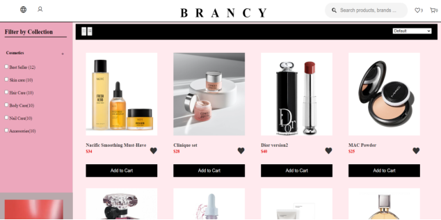
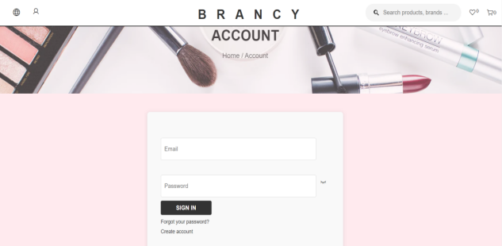
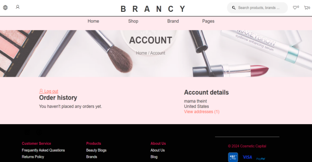
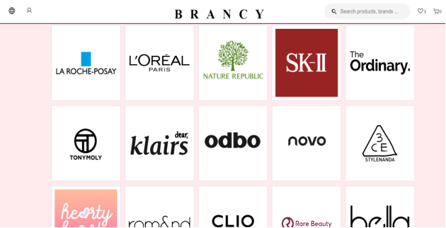
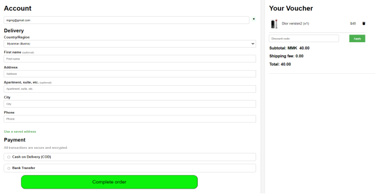

# 💄 BRANCY - Branded Cosmetics Website

## 📌 Overview

BRANCY is a web-based e-commerce platform designed to provide a seamless and user-friendly shopping experience for branded cosmetic products. The system allows users to browse products, manage accounts, and place orders efficiently while enabling administrators to manage inventory and customer data.

This project was developed as part of a Special Project at Myanmar Institute of Information Technology (MIIT).

---

## 🚀 Features

### 👤 Customer

* User registration and login
* Browse products by categories
* View detailed product information
* Add to cart and checkout
* Track order status

### 🛠 Admin

* Manage products and inventory
* View customer data and orders
* Update product listings
* Monitor system activities

### 💬 Support

* Handle customer inquiries
* Manage feedback and reviews
* Support order-related issues (returns/exchanges)

---

## 🛠 Tech Stack

**Frontend**

* HTML
* CSS
* JavaScript

**Backend**

* Python
* Django

**Database**

* SQLite (Django default)

**Tools**

* Visual Studio Code
* Git & GitHub

---

## 🧠 Project Purpose

The goal of this project is to:

* Provide an online platform for branded cosmetics
* Improve accessibility to beauty products
* Offer detailed product information for better decision-making
* Deliver a smooth and responsive user experience

## 🤝 Project Team

This project was developed collaboratively at **Myanmar Institute of Information Technology (MIIT)**.

**Team Members**

* Khin Myat Thu (2021-MIIT-CSE-020)
* Lin Lae Phyu (2021-MIIT-CSE-028)
* Theint Shwe Sin (2021-MIIT-CSE-074)

**Supervisor**

* Daw Yin Myo Kay Khine Thaw


## 📸 Screenshots

### 🏠 Home Page


### 🛍 Product Categories



### 🔐 Customer Login



### 📝 Create Account


### 🚪 Logout



### 💄 Brand Page



### 🛒 Checkout Page



### ⚙️ Django Admin Panel


---

## ⚙️ Installation & Setup

```bash
# Clone the repository
git clone https://github.com/yourusername/brancy-cosmetics.git

# Navigate into the project
cd brancy-cosmetics

# Create virtual environment
python -m venv venv

# Activate environment (Windows)
venv\Scripts\activate

# Install dependencies
pip install -r requirements.txt

# Run server
python manage.py runserver
```

---

## 🧩 Project Structure

```
onlineshop/
├── media/
├── onlineshop/
├── screenshots/
├── static/
├── store/
├── manage.py
├── .gitignore
└── README.md
```

---

## ⚠️ Limitations

* Requires internet connection
* Focused only on cosmetics products
* Depends on accurate data input

---

## 🧪 Challenges Faced

* Learning Django framework
* Integrating frontend with backend
* Managing database and product data
* Ensuring smooth user experience

---

## 👩‍💻 My Contribution

* Developed frontend using HTML, CSS, JavaScript
* Implemented backend using Django
* Designed database structure
* Built authentication and shopping features

---

## 📚 References

* https://www.geeksforgeeks.org/
* https://www.youtube.com/
* https://fabric.inc/blog/commerce/ecommerce-database-design-example

---

## ⚠️ Notice

This project is created for educational and portfolio purposes only.
Please do not copy, reuse, or redistribute without permission.

---

## 📄 License

This project is licensed under the MIT License.

---

## 🙌 Acknowledgement

This project was developed under the guidance of instructors at Myanmar Institute of Information Technology (MIIT).

---

## ⭐ Final Note

This repository represents a student project and learning journey.
Feedback and suggestions are always welcome.
